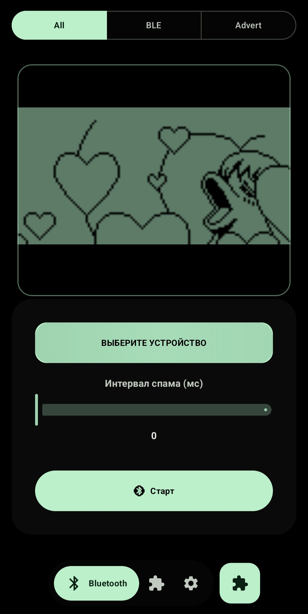
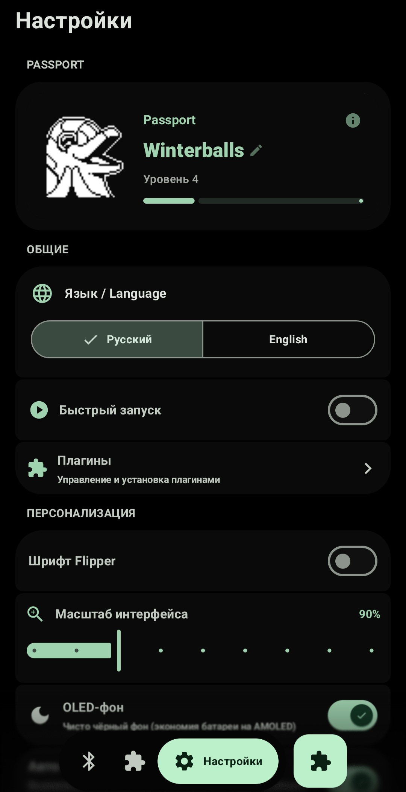
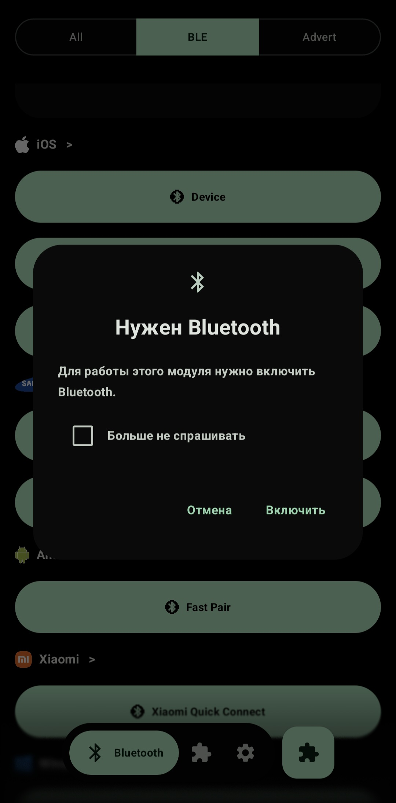

  

# Dolphy-App-Improved

Android multi-tool for wireless protocol research: NFC, BLE, IR, Wi-Fi, HID. No root required.

## Screenshots

  
  
  

## Fixes in this fork

- **Dolphin animation**
  - No longer disappears after level 4 (fallback to any available animation when the current level has none)
  - No flicker between frames (pre-decoding frames once per animation)
  - No reload when returning to home (frame cache kept in memory)

- **Bluetooth dialog**
  - No longer freezes and blocks the screen (removed the old dialog that re-triggered on every recomposition)
  - Module starts right after the user enables Bluetooth (fixed the empty launcher callback)
  - Added a Material 3 dialog with a "Don't ask again" checkbox

- **Profile name limit** — raised from 10 to 20 characters

- **Plugin manager list** — now scrolls properly (fixed nestedScroll conflict from the hidden TopAppBar)

## New features

- **NFC auto-read toggle** — turn off automatic NFC tag reading (useful if you keep a card in your phone case)
- **OLED background toggle** — pure black background for AMOLED screens (saves battery)

## Something important:
unvoiddd cool dude

## Requirements

- Android 10+ (minSdk 26)
- Some modules require root, IR blaster, or BLE/NFC hardware
